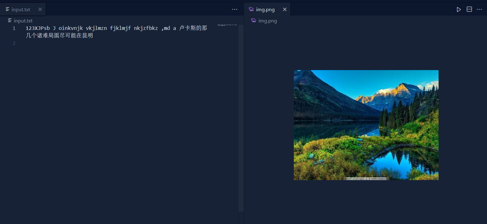
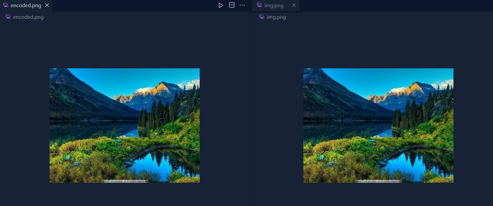
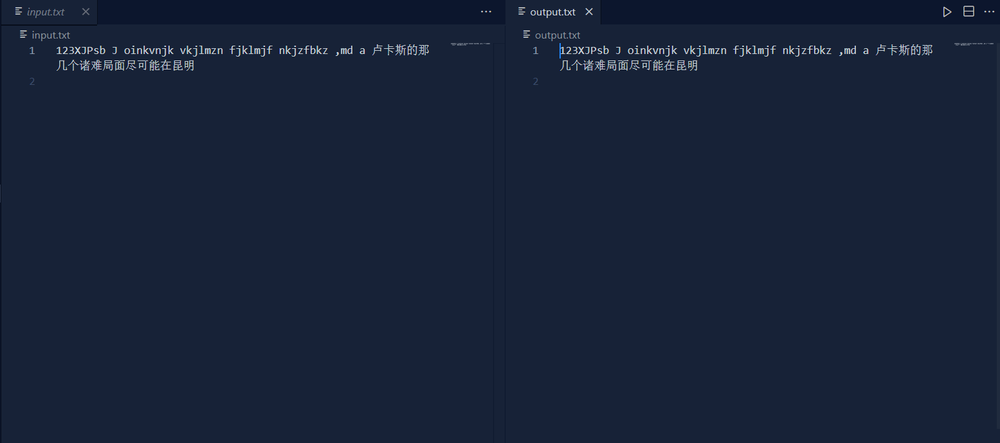

# LSBimage_hiding_demo
利用LSB算法将文本藏入图像的python脚本。
## 原理
LSB即为最低有效位（Least Significant Bit，lsb），图片中的图像像素一般是由RGB三原色（红绿蓝）组成，每一种颜色占用8位，取值范围为0x00~0xFF，即有256种颜色。LSB隐写就是修改RGB颜色分量的最低二进制位也就是最低有效位（LSB），而人类的眼睛不会注意到这前后的变化，本项目中隐写的位数为4。

将文本的utf8编码与每个像素的LSB异或即可实现信息隐藏。由于异或两次等于原样，解码时同样与原图片异或。
## 使用说明
由于LSB算法对压缩敏感，输入图片格式不得为jpg
### 需要的包
```
numpy
PIL
```

### 命令行执行
编码：
```
python encode.py
```
参数说明：
```
usage: encode.py [-h] [-img IMG] [-txt TXT] [-result RESULT]

将txt文本藏入png图片

options:
  -h, --help      show this help message and exit
  -img IMG        原图片地址
  -txt TXT        待编码文本地址
  -result RESULT  编码后图片地址
```  
解码：
```
python decode.py
```
参数说明：
```
usage: decode.py [-h] [-img IMG] [-refer REFER] [-result RESULT]

从图片中提取隐藏信息

options:
  -h, --help      show this help message and exit
  -img IMG        待解码的图片的地址
  -refer REFER    原图片地址
  -result RESULT  解码后文字的保存地址
```
### 直接运行python程序
各文本路径均在定义parser的default参数修改
## 效果
输入文本与图像

隐藏后图像

解码结果与原文一致

